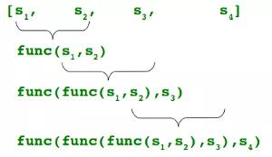

# python中文指南

## 数据类型

### 变量与常量

变量不需要声明类型，因为python是动态语言

```
age=18
name="tom"
```

变量使用=赋值，通过==比较两个值是否相等

```
age=18
age==18 #true
```

变量要先创建再使用。

变量赋值方式：

```
age=18
a=b=c=1
age=18+1
a,b,c=1,2,3
```

理解变量赋值：当写`a=“tom”`，python解释器现在内存中创建"tom"字符串对象，然后在内存中创建名为a的变量并把它指向"tom"。当把一个变量a赋值给另一个变量b，这个操作实际上是将变量b指向变量a所指向的数据。（**Python中的一切都是对象，变量是对象的引用**）

```
a="tom"
b=a
print(b)# tom
# id()可以查看变量值的内存地址
print(id(a))# 1828073160064
print(id(b))# 1828073160064

a="lucy"
print(b)
print(id(a))# 1828075999312
print(id(b))# 1828073160064
```

常量：

常量就是不变的变量，比如常用的数学常数圆周率就是一个常量。在Python中，通常用全部大写的变量名表示常量。但事实上，PI仍然是一个变量，因为Python根本没有任何机制保证PI不会被改变。完全可以给PI赋值为10，不会弹出任何错误。所以，用全部大写的变量名表示常量只是一个习惯上的用法。

```
PI=3.14
```


### 字符串类型

使用**单引号**或**双引号**来创建字符串，使用**三引号**创建多行字符串。

Python不支持单字符类型，单字符在Python中也是作为一个字符串使用。

```
a='tom'
a="tom"
a='''tom'''
a="""tom"""
```

如果一个字符串里，要有引号，那么最好和外部包裹的引号类型不同

```
msg = "my name is 'Jack'"
msg = 'my name is "Jack"'
msg = 'what\'s you name?'
```

字符串常用方法：

+ 去除首尾空格

```
>>> msg = "    Python编程时光    "
>>>
>>> msg.lstrip()  # 去除左边空格
'Python编程时光    '
>>> msg.rstrip()  # 去除右边空格
'    Python编程时光'
>>>
>>> msg.strip()  # 去除左右两边空格
'Python编程时光'
```

+ 判断字符串是否以某字符串结尾或开头

```
>>> msg = "Hello, Python"
>>>
>>> msg.endswith("Python")
True
>>> msg.endswith("python")
False
>>> msg.startswith("Hello")
True
>>> msg.startswith("hello")
False
```

+ 分隔字符串

```
>>> languages = "Python,Java,Golang"
>>> languages.split(",")
['Python', 'Java', 'Golang']
```


### 整数与浮点数

Python 支持的数字类型有三种：**整数**、**浮点数**和**复数**。

整数：

```
>>> a = 100
>>> type(a)
<class 'int'>
```

浮点数：

之所以称为浮点数，是因为按照科学记数法表示时，一个浮点数的小数点位置是可变的，比如，`1.23x10^9`和`12.3x10^8`是完全相等的。浮点数可以用数学写法，如`1.23`，`3.14`，`-9.01`，等等。但是对于很大或很小的浮点数，就必须用科学计数法表示，把10用e替代，如0.000012可以写成`1.2e-5`

```
>>> a = 1.23
>>> a
1.23
>>> type(a)
<class 'float'>
```

复数：

复数由实数部分和虚数部分构成，可以用`a + bj`，或者 `complex(a,b)` 表示，复数的实部a和虚部b都是浮点型

```
>>> a = 10 + 0.2j
>>> a
(10+0.2j)
>>> type(a)
<class 'complex'>
>>>
>>> b = complex(10, 0.2)
>>> b
(10+0.2j)
>>> type(b)
<class 'complex'>
```

常用方法：

+ `+`
+ `-`
+ `*`
+ `/` 除法
+ `//` 取整
+ `abs()` 取绝对值
+ `int()` 取整
+ `round()` 四舍五入


### 布尔值

布尔类型只有两个值，True真、False假，首字母要大写

Python内置的 `bool()` 函数可以用来测试一个表达式的布尔值结果。

```
>>> bool(1)
True
>>> bool(0)
False
>>> bool([])
False
>>> bool(())
False
>>> bool({})
False
>>> bool(-1)
True
>>> bool('')
False
>>> bool(None)
False
>>> bool("False")
True
>>> bool("True")
True
>>> bool(0.0)
False
>>> bool(1.0)
True
>>> bool(-0.0)
False
```

据此总结出：

下面这些值经过 bool 转换后是**假值**：

- 0、0.0、-0.0
- None
- 空字符串、空列表、空元组、空字典

而这些会转换成**真值**：

- -1、1或者其他非0数值
- 所有非空字符串，包括 `"False"`
- 所有非空字典、非空列表、非空集合，非空元组

布尔类型可以进行 and（与）、or（或）、not（非）运算。

**空值：None**

空值是Python里一个特殊的值，用None表示（首字母大写）。None不能理解为 0，因为0是整数类型，而None是一个特殊的值。

```
>>> bool(None)
False
>>> type(None)
<class 'NoneType'>
```


### 输入输出

**输入：**

input函数：获取用户输入，返回**字符串**

```
>>> age = input("please input your age: ")
please input your age: 18
>>> age
'18'
>>> age = int(age)
>>> age
18
>>> type(age)
<class 'int'>
```

input函数有时可以巧妙地用于阻塞或暂停程序

```
input("请按回车继续......") 
```

**输出：**

print可以接受多个字符串，字符串类型的变量或者可print的对象。每个字符串用逗号“,”隔开，连成一串输出。print会依次打印每个字符串，同时，每遇到一个逗号“,”就输出一个空格。

```
>>> a = "i am"
>>> b = "student"
>>> print(a,"a" , b)
i am a student      # 自动以空格分隔
>>> print(a+"a"+b)
i amastudent        # 无分隔
```

看下print函数原型：`print(self, *args, sep=' ', end='\n', file=None)`

**sep参数**: 分隔的符号，默认是一个空格；

**end参数**: 打印后的结束方式，默认为换行符`\n`。如果，设置`end=''`，则可以不换行，让print在一行内连续打印。

```
>>> a = "i am"
>>> b = "student"
>>> print(a,"a" , b, sep="*")
i am*a*student
```


### 字符串格式化

格式化输出，主要有三种方式

1. 使用 % 进行格式化
2. 使用 format 函数进行格式化
3. 使用 f-string 进行格式化

**%**

```
>>> name = "Jack"
>>> age = 18
>>> print("我的名字是: %s，今年 %d 岁" %(name, age))
我的名字是: Jack，今年 18 岁
```

**format**

使用 `{}` 进行占位，然后在字符串后跟上 `.format()` 函数，这个函数的参数就是我们要往字符串中填充的变量。

format 函数会依次填充，比如第一个 `{}` 会取到第一个参数 name，第二个 `{}` 会取到第二个参数 age

```
>>> name = "Jack"
>>> age = 18
>>> print("我的名字是:{}, 今年 {} 岁".format(name, age))
我的名字是:Jack, 今年 18 岁
```

可以改成使用索引：

```
>>> print("我的名字是:{0}, 今年 {1} 岁".format(name, age))
我的名字是:Jack, 今年 18 岁
```

可以直接用变量名进行替代：

```
>>> name = "Jack"
>>> age = 18
>>> print("我的名字是:{name}, 今年 {age} 岁".format(name=name, age=age))
我的名字是:Jack, 今年 18 岁
```

**f-string**

 Python 3.6 才支持。在字符串前面加一个 `f`，开启 f-string ，就可以在字符中写入变量。

```
>>> name = "Jack"
>>> age = 18
>>> print(f"我的名字是:{name}, 今年 {age} 岁")
我的名字是:Jack, 今年 18 岁
```


### 运算符

Python语言支持以下类型的运算符:

- 算术运算符：`+ - * / %取模 **幂 //取整`

```
>>> 5/2
2.5
>>> 5//2
2
>>> 5%2
1
>>>
```

- 比较（关系）运算符：`== != > < >= <=`
- 赋值运算符：`= += -= *= /= %= **= //=`
- 逻辑运算符：`and or not`
- 位运算符：`& | ^ ~ << >>`
- 成员运算符：`in`   `no in`

```
>>> "apple" in ("apple","xiaomi") # 元组
True
>>> "apple" in "i have an apple" # 字符串
True
>>> "apple" in ["apple","xiaomi"] # 列表
True
>>> "apple" in {"apple":"xiaomi"} # 字典
True
>>> "xiaomi" in {"apple":"xiaomi"}
False
>>> "apple" in {"apple","xiaomi"} # 集合
True
>>>
```

- 身份运算符：`is`    `is not`

is是判断两个标识符是不是引用自一个对象。 x is y, 如果 id(x) 等于 id(y) , is 返回结果 1

is not是判断两个标识符是不是引用自不同对象。x is not y, 如果 id(x) 不等于 id(y) , is not 返回结果 1

```
>>> a = 1000
>>> b = 1000
>>> id(a)
4532310864
>>> id(b)
4532311632
>>> a is b
False
```

- 运算符优先级，不管，用`()`控制优先级


## 数据结构

### list

由一系列元素按顺序进行排列而成的容器。

- **元素**：没有要求同一类型，可以是**任意类型**。
- **顺序**：按顺序排列而成，**列表有序**。


**创建列表：**

+ 先创建空列表实例，再往实例中添加元素

```
>>> phones = list()   # 实例化
>>> phones.append("Apple")  # 添加元素
>>> phones.append("Huawei")  # 添加元素
>>> phones.append("Xiaomi")  # 添加元素
>>> phones
['Apple', 'Huawei', 'Xiaomi']
```

+ 直接定义列表，并填充元素。

```
>>> phones = ["Apple", "Huawei", "Xiaomi"]
>>> phones
['Apple', 'Huawei', 'Xiaomi']
```

第二种的效率也比第一种的要高

**增删改查：**

查看元素：

```
>>> phones = ["Apple", "Huawei", "Xiaomi", "Huawei"]
>>> phones[0]
'Apple'
>>> phones.index("Huawei") #查看第一个值为 Huawei 的索引
1
>>> phones.count("Huawei")
2
>>> len(phones)
4
```

添加元素：

+ append 

```
>>> phones = []
>>> phones
[]
>>> phones.append("Apple")
>>> phones
['Apple']
```

+ insert

```
>>> phones = ["Apple", "Huawei", "Xiaomi"]
>>> phones.insert(1, "OPPO")  # 把 OPPO 插入到索引为 1 的位置
>>> phones
['Apple', 'OPPO', 'Huawei', 'Xiaomi']
```

+ extend

```
>>> phones = ["Apple", "Huawei", "Xiaomi"]
>>> new_phones = ["OPPO", "VIVO"]
>>> phones.extend(new_phones)
>>> phones
['Apple', 'Huawei', 'Xiaomi', 'OPPO', 'VIVO']
```

修改元素：

```
>>> phones = ["Apple", "Huawei", "Xiaomi"]
>>> phones[1] = "OPPO"
>>> phones
['Apple', 'OPPO', 'Xiaomi']
```

删除元素：

+ pop

```
>>> phones = ["Apple", "Huawei", "Xiaomi"]
>>> phones.pop()  # 删除最后一个元素
'Xiaomi'
>>> phones.pop(0) # 删除索引为0的元素
'Apple'
>>> phones
['Huawei']
>>>
```

+ remove

```
>>> phones = ["Apple", "Huawei", "Xiaomi", "Huawei"]
>>> phones.remove("Huawei")# 删除第一个值为 Huawei 的元素。
>>> phones
['Apple', 'Xiaomi', 'Huawei']
>>>
```

+ clear

```
>>> phones = ["Apple", "Huawei", "Xiaomi"]
>>> phones.clear()
>>> phones
[]
>>>
```

+ del

```
>>> phones = ["Apple", "Huawei", "Xiaomi"]
>>> del phones[:] # 清空列表
>>> phones
[]
>>>
```

使用 del 语句，还可以删除某一个或者某几个连续的元素。

```python
>>> phones = ["Apple", "Huawei", "Xiaomi", "OPPO", "VIVO"]
>>> del phones[0]  # 删除索引为0的元素
>>> phones
['Huawei', 'Xiaomi', 'OPPO', 'VIVO']
>>>
>>> del phones[1:3]  # 删除索引在 [1:3) 区间内元素，注意是左闭右开区间
>>> phones
['Huawei', 'VIVO']
```


**列表反转：**

+ reverse

原地反转，作用在原对象上

```
>>> nums = [1,2,3,4,5]
>>> nums.reverse()
>>> nums
[5, 4, 3, 2, 1]
```

+ 切片

返回一个新对象，原对象不改变

```
>>> nums = [1,2,3,4,5]
>>> nums[::-1]
[5, 4, 3, 2, 1]
```


**列表排序：**

+ 列表内置sort

```
>>> alist = [4,8,1,7,2]
>>> alist.sort()
>>> alist
[1, 2, 4, 7, 8]
>>>
```

+ python内置sorted

```
>>> alist = [4,8,1,7,2]
>>> sorted(alist)
[1, 2, 4, 7, 8]
>>>
```

不管用哪种方法，都要保证列表内的元素俩俩是可比较的。

比如，数值和数值是可比较的，字符串和字符串之间是可比较的，但是数值和字符串是不可比较的：

```
>>> alist = [9,3,1,"d","k","a"]
>>> alist.sort()
Traceback (most recent call last):
  File "<stdin>", line 1, in <module>
TypeError: '<' not supported between instances of 'str' and 'int'
>>>
```


### tuple

和列表非常的相似，元组也是由一系列元素按顺序进行排列而成的容器。

与列表不同的是，**元组是不可变**的，而列表是可变的

**创建元组：**

+ 直接使用 圆括号 将所有的元素进行包围。

```
>>> atuple = (1,2,3,4)
>>> atuple
(1, 2, 3, 4)
>>>
```

+ 有时候，创建元组时，圆括号可有可无的。

```
>>> btuple = 1,2,3,4
>>> btuple
(1, 2, 3, 4)
>>>
```

+ 使用元组推导式，由于元组是不可变的，所以生成一个生成器对象。

```
>>> ctuple = (i for i in range(1,6))
>>> ctuple
<generator object <genexpr> at 0x10a288f90>
```

+ 创建只包含一个元素的元组时，要在第一个元素后面加一个逗号

```
>>> ctuple = (1)
>>> type(ctuple)
<class 'int'>
>>> ctuple
1
>>>
```

```
>>> ctuple = (1,)
>>> type(ctuple)
<class 'tuple'>
>>> ctuple
(1,)
>>>
>>> dtuple = 1,
>>> type(dtuple)
<class 'tuple'>
>>> dtuple
(1,)
```

+ 创建空元组

```
>>> a = tuple()  # 第一种方法
>>> a
()
>>> type(a)
<class 'tuple'>
>>> b = ()  # 第二种方法
>>> b
()
>>> type(b)
<class 'tuple'>
```


**查：**

```
>>> atuple = (1,2,3,4)
>>> atuple[0]   # 查看元素
1
```


**元组与列表的转换：**

元组是 immutable （不可变的），其序列通常包含不同种类的元素，并且通过解包或者索引来访问（如果是 `namedtuples` 的话甚至还可以通过属性访问）

列表是 mutable （可变的），并且列表中的元素一般是同种类型的，并且通过迭代访问。

+ 元组--->列表

```
>>> atuple = (1,2,3,4)
>>> type(atuple)
<class 'tuple'>
>>>
>>>
>>> list(atuple)
[1, 2, 3, 4]
>>>
>>>
```

+ 列表--->元组

```
>>> alist = [1,2,3,4]
>>> type(alist)
<class 'list'>
>>>
>>>
>>> tuple(alist)
(1, 2, 3, 4)
```


### dict

字典（英文名 dict），它是由一系列的键值（key-value）对组合而成的数据结构。

字典中的每个键都与一个值相关联，其中

1. 键，必须是可 hash 的值，如字符串，数值等
2. 值，则可以是任意对象


**创建字典：**

+ 先使用 `dict()` 创建空字典实例，再往实例中添加元素

```
>>> profile = dict(name="王炳明", age=27, 众号="ython编程时光")
>>> profile
{'name': '王炳明', 'age': 27, '众号': 'ython编程时光'}
```

+ 直接使用 `{}` 定义字典，并填充元素

```
>>> profile = {"name": "王炳明", "age": 27, "公众号": "Python编程时光"}
>>> profile
{'name': '王炳明', 'age': 27, '公众号': 'Python编程时光'}
```

+ 使用 `dict()` 构造函数可以直接从键值对序列里创建字典。

```
>>> info = [('name', '王炳明 '), ('age', 27), ('公众号', 'Python编程时光')]
>>> dict(info)
{'name': '王炳明 ', 'age': 27, '公众号': 'Python编程时光'}
```

+ 使用字典推导式

```
>>> adict = {x: x**2 for x in (2, 4, 6)}
>>> adict
{2: 4, 4: 16, 6: 36}
```


**增删改查：**

查看：

+ 直接使用 `dict[key]` 。但这种方法，在 key 不存在时会报 KeyValue 的异常

```
>>> profile = {"name": "王炳明", "age": 27, "公众号": "Python编程时光"}
>>> profile["公众号"]
'Python编程时光'
```

+ 使用 `get()` 函数。当不存在 gender 的key时，默认返回 male

```
>>> profile = {"name": "王炳明", "age": 27, "公众号": "Python编程时光"}
>>> profile.get("gender", "male")
'male'
```

新增：

```
>>> profile = dict()
>>> profile
{}
>>> profile["name"] = "王炳明"
>>> profile["age"] = 27
>>> profile["公众号"] = "Python编程时光"
>>> profile
{'name': '王炳明','age': 27,'公众号': 'Python编程时光'}
```

修改：

```
>>> profile = {"name": "王炳明", "age": 27, "公众号": "Python编程时光"}
>>>
>>> profile["age"] = 28
>>> profile
{'name': '王炳明', 'age': 28, '公众号': 'Python编程时光'}
```

删除：

+ pop

```
>>> profile = {"name": "王炳明", "age": 27, "公众号": "Python编程时光"}
>>> profile.pop("age")
27
>>> profile
{'name': '王炳明', '公众号': 'Python编程时光'}
```

+ del

```
>>> profile = {"name": "王炳明", "age": 27, "公众号": "Python编程时光"}
>>> del profile["age"]
>>> profile
{'name': '王炳明', '公众号': 'Python编程时光'}
```

+ clear

```
>>> profile = {"name": "王炳明", "age": 27, "公众号": "Python编程时光"}
>>> profile.clear()
>>> profile
{}
>>>
```


**重要方法：**

+ 判断key是否存在

```
>>> profile = {"name": "王炳明", "age": 27, "公众号": "Python编程时光"}
>>> "name" in profile
True
>>>
>>> "gender" in profile
False
```

+ 设置默认值

```
profile = {"name": "王炳明", "age": 27, "公众号": "Python编程时光"}

if "gender" not in profile:
    profile["gender"] = "male"
```

更简单的方法：

```
profile = {"name": "王炳明", "age": 27, "公众号": "Python编程时光"}
profile.setdefault("gender", "male")
```


### set

集合（英文名 set），它是一个**无序**的**不重复**元素序列。

**创建集合：**

+ 使用 花括号 `{}` 直接创建，创建的时候，`{}` 可以包含有重要的元素，但是创建完后，集合会去重，只留第一个。

```
>>> aset = {"Apple", "Huawei", "Xiaomi"}
>>> aset
set(['Huawei', 'Xiaomi', 'Apple'])
```

+ 使用 `set()` 方法进行创建，当`set()` 函数不接任何参数时，创建的是空集合，如果不创建空集合，可以传入一个列表。

```
>>> bset = set()  # 空集合
>>> bset
set([])
>>>
>>> cset = set(["Apple", "Huawei", "Xiaomi"])
>>> cset
set(['Huawei', 'Apple', 'Xiaomi'])
```


**增删：**

增加：

+ add

```
>>> aset = set()
>>>
>>> aset
set([])
>>> aset.add("Apple")
>>> aset.add("Huawei")
>>> aset
set(['Huawei', 'Apple'])
```

+ update

```
>>> aset = set()
>>> aset
set([])
>>>
>>> # 接集合
>>> aset.update({"Apple"})
>>> aset
set(['Apple'])
>>>
>>> # 接列表
>>> aset.update(["Huawei"])
>>> aset
set(['Huawei', 'Apple'])
>>>
>>> # 接元组
>>> aset.update(("Xiaomi",))
>>> aset
set(['Huawei', 'Apple', 'Xiaomi'])
>>>
>>> # 接字典
>>> aset.update({"VIVO": "xxxx"})
>>> aset
set(['Huawei', 'Apple', 'VIVO', 'Xiaomi'])
```

删除元素：

+ remove

如果对应的元素不存在，是会报错的。

```
>>> aset = {"Apple", "Huawei", "Xiaomi"}
>>> aset.remove("Xiaomi")
>>> aset
set(['Huawei', 'Apple'])
```

+ discard

存在元素则移除，不存在也不会报错。

```
>>> aset = {"Apple", "Huawei", "Xiaomi"}
>>> aset.discard("VIVO")
>>> aset
set(['Huawei', 'Xiaomi', 'Apple'])
```

+ pop

用于从集合中随机删除元素，和列表、字典的 `pop` 不一样，这里的 pop 不能加任何的参数。

```
>>> aset = {"Apple", "Huawei", "Xiaomi"}
>>> aset.pop()
'Huawei'
>>> aset.pop()
'Xiaomi'
>>> aset.pop()
'Apple'
```

+ clear

```
>>> aset = {"Apple", "Huawei", "Xiaomi"}
>>> aset
set(['Huawei', 'Xiaomi', 'Apple'])
>>> aset.clear()
>>> aset
set([])
```


可以查看集合的长度：

```
>>> aset = {"Apple", "Huawei", "Xiaomi"}
>>> len(aset)
3
```

**集合运算：**

+ 求合集

```
>>> aset = {"Apple", "Huawei"}
>>> bset = {"Xiaomi", "Huawei"}
>>> aset.union(bset)
set(['Huawei', 'Apple', 'Xiaomi'])
>>> aset | bset
set(['Huawei', 'Apple', 'Xiaomi'])
```

+ 求差集

```
>>> aset = {"Apple", "Huawei"}
>>> bset = {"Xiaomi", "Huawei"}
>>> aset.difference(bset)
set(['Apple'])
>>> aset - bset
set(['Apple'])
```

+ 求交集

```
>>> aset = {"Apple", "Huawei"}
>>> bset = {"Xiaomi", "Huawei"}
>>> aset.intersection(bset)
set(['Huawei'])
>>> aset & bset
set(['Huawei'])
```

和 `intersection` 相似的还有一个 `intersection_update` 函数，它们的区别是，`intersection_update` 会原地更新在 aset 上，而不是会回交集。

```
>>> aset = {"Apple", "Huawei"}
>>> bset = {"Xiaomi", "Huawei"}
>>> aset.intersection_update(bset)
>>> aset
set(['Huawei'])
```

+ 求不重合集

```
>>> aset = {"Apple", "Huawei"}
>>> bset = {"Xiaomi", "Huawei"}
>>> aset.symmetric_difference(bset)
set(['Xiaomi', 'Apple'])
```

和 `symmetric_difference` 相似的还有一个 `symmetric_difference_update` 函数，它们的区别是，`symmetric_difference_update` 会原地更新在 aset 上，而不是直接返回。

```
>>> aset = {"Apple", "Huawei"}
>>> bset = {"Xiaomi", "Huawei"}
>>> aset.symmetric_difference_update(bset)
>>> aset
set(['Apple', 'Xiaomi'])
```


**集合判断：**

+ 判断是否有某元素

```
>>> aset = {"Apple", "Huawei"}
>>> "Apple" in aset
True
```

+ 判断两集合是否有相同的元素

```
>>> aset = {"Apple", "Huawei"}
>>> bset = {"Xiaomi", "Huawei"}
>>> aset.isdisjoint(bset)
False # 有相同的元素，返回False；没有相同的元素，返回True
```

+ 判断是否是子集

```
>>> aset = {"Apple", "Huawei"}
>>> bset = {"Huawei"}
>>> bset.issubset(aset)
True
```


### 迭代器

**可迭代对象：**

**可以利用 for 循环的对象，都叫可迭代对象。**

序列（列表、元组、字典的键、字符串）、集合等等都是可迭代的

可以借助Python 内置的 `collections.abc` 模块中的Iterable 类 判断（并不一定准确）。

```
>>> from collections.abc import Iterable
>>>
>>> isinstance([0, 1, 2], Iterable) # 列表
True
>>> isinstance({"name": "王炳明"}, Iterable) # 字典
True
>>> isinstance((1,2,3), Iterable) # 元组
True
>>> isinstance("hello", Iterable) # 字符串
True
```

**可迭代协议：**

+ 如果一个对象内部实现了 `__iter__()` 方法 ，并返回一个迭代器实例，那么该对象就是可迭代对象

```
from collections.abc import Iterable
class Array:
    mylist = [0,1,2]

    # 返回迭代器类的实例
    def __iter__(self):
        return iter(self.mylist)

# 得到可迭代对象
my_list = Array()
print(isinstance(my_list, Iterable)) # True

for i in my_list:
    print(i)
# 0
# 1
# 2
```

+ 设一个对象没有实现 `__iter__()` ，Python 解释器 `__getitem__()` 方法获取元素，如果可行，那么该对象也是一个可迭代对象。

```
from collections.abc import Iterable

class Array:
    mylist = [0,1,2]

    def __getitem__(self, item):
        return self.mylist[item]

# 得到一个可迭代对象
my_list = Array()
print(isinstance(my_list, Iterable)) # False

for i in my_list:
    print(i)
# 0
# 1
# 2
```

此时如果使用 `isinstance(my_list, Iterable)` 去判断是否是可迭代，就会返回 False，因为 isinstance 这种方法就是检查对象是否有 `__iter__` 方法，所以说使用`isinstance(my_list, Iterable)` 去判断是否可迭代是不准确的。

**什么是迭代器：**

对一个可迭代对象使用 iter 函数后，它会返回一个迭代器对象，对于迭代器对象，我们可以使用 next 函数，去获取元素，每执行一次，获取一次，等到全部获取完毕，会抛出 StopIteration 提示无元素可取。

```cmd
>>> alist = [0, 1, 2, 3]
>>> gen = iter(alist)
>>> gen
<list_iterator object at 0x100a94b20>
>>> next(gen)
0
>>> next(gen)
1
>>> next(gen)
2
>>> next(gen)
3
>>> next(gen)
Traceback (most recent call last):
  File "<stdin>", line 1, in <module>
StopIteration
```


**迭代器协议：**

对比可迭代对象，`迭代器`的内部多了一个 `__next__()`  函数。

迭代器，是在可迭代的基础上实现的。

```
from collections.abc import Iterator

class Array:
    index = 0
    mylist = [0,1,2]

    # 返回该对象的迭代器类的实例
    # 因为自己就是迭代器，所以返回self
    def __iter__(self):
        return self

    # 当无元素时，必要抛出 StopIteration
    def __next__(self):
        if self.index <= len(self.mylist)-1:
            value = self.mylist[self.index]
            self.index += 1
            return value
        raise StopIteration

my_iterator = iter(Array())
print(isinstance(my_iterator, Iterator)) # output: True
print(next(my_iterator))  # output: 0
print(next(my_iterator))  # output: 1
print(next(my_iterator))  # output: 2
print(next(my_iterator))  # StopIteration
```


### 生成器

生成器（英文名 Generator ），是一个可以像迭代器那样使用for循环来获取元素的函数。

```
>>> gen = (i for i in range(5))
>>> gen
<generator object <genexpr> at 0x10cae50b0>
```

如果把`()`换成`[]`就是列表推导式了。

**yield**

- 当一个函数运行到 yield 后，函数的运行会暂停，并且会把 yield 后的值返回出去。
- 若 yield 没有接任何值，则返回 None
- yield 虽然返回了，但是函数并没有结束

```
>>> def generator_factory(top=5):
...     index = 0
...     while index < top:
...         print("index 值为: " + str(index))
...         index = index + 1
...         yield index
...     raise StopIteration
...
>>> gen = generator_factory()
>>> gen
<generator object generator_factory at 0x1018340b0>
```

**从生成器中取元素：**

+ 使用 next 方法一个一个地把元素取出来，如果元素全部取完了，生成器会抛出 `StopIteration` 的异常。

```
>>> gen = (x for x in range(3))
>>> gen
<generator object <genexpr> at 0x1072400b0>
>>> next(gen)
0
>>> next(gen)
1
>>> next(gen)
2
>>> next(gen)
Traceback (most recent call last):
  File "<stdin>", line 1, in <module>
StopIteration
```

+ 使用 for 循环一个一个地迭代出来

```
>>> gen = (x for x in range(3))
>>> for i in gen:
...     print(i)
...
0
1
2
```

**生成器的激活：**

生成器对象，在创建后，并不会执行任何的代码逻辑。

想要从生成器对象中获取元素，那么第一步要触发其运行。

方法有两种：

1. 使用`next()` 
2. 使用`generator.send(None)`

```
def generator_factory(top=5):
    index = 0
    while index < top:
        print("index 值为: " + str(index))
        index = index + 1
        yield index
    # raise StopIteration
gen = generator_factory()
gen.send(None)
gen.send(None)
# index 值为: 0
# index 值为: 1
```

**生成器的状态：**

生成器在其生命周期中，会有如下四个状态

- `GEN_CREATED` # 生成器已创建，还未被激活
- `GEN_RUNNING` # 解释器正在执行（只有在多线程应用中才能看到这个状态）
- `GEN_SUSPENDED` # 在 yield 表达式处暂停
- `GEN_CLOSED` # 生成器执行结束

```
>>> gen = (x for x in range(2))
>>> from inspect import getgeneratorstate
>>> gen = (x for x in range(3))
>>> getgeneratorstate(gen)
'GEN_CREATED'
>>>
>>> next(gen)
0
>>> getgeneratorstate(gen)
'GEN_SUSPENDED'
>>> next(gen)
1
>>> next(gen)
Traceback (most recent call last):
  File "<stdin>", line 1, in <module>
StopIteration
>>> getgeneratorstate(gen)
'GEN_CLOSED'
```

**生成器的异常：**

```
def generator_factory(top=2):
    index = 0
    while index < top:
        index = index + 1
        yield index
    raise StopIteration
```

在没有元素可返回时，最后抛出了 `StopIteration` 异常，这是为了满足生成器的协议。

实际上，如果不手动抛出 `StopIteration`，在生成器遇到函数 return 时，会自动抛出 `StopIteration`。

```
def generator_factory(top=2):
    index = 0
    while index < top:
        index = index + 1
        yield index
gen = generator_factory()
next(gen)
next(gen)
next(gen)
# Traceback (most recent call last):
#   File "D:\myspace\workspace\Python\learnpython\01\demo.py", line 9, in <module>
#     next(gen)
# StopIteration
```


## 流程控制

###  条件语句if

```
if 判断条件1：
    执行语句……
elif 判断条件2：
    执行语句……
elif 判断条件3：
    执行语句……
else:
    执行语句……
```

### 循环语句for

**普通循环：**

```
>>> phones = ["Apple", "Huawei", "Xiaomi"]
>>> for phone in phones:
...     print("当前手机是: " + phone)
...
当前手机是: Apple
当前手机是: Huawei
当前手机是: Xiaomi
```

**带索引循环：**

```
>>> phones = ["Apple", "Huawei", "Xiaomi"]
>>>
>>> for index,phone in enumerate(phones):
...     print("我的第 {} 把手机是: {}".format(index+1, phone))
...
我的第 1 把手机是: Apple
我的第 2 把手机是: Huawei
我的第 3 把手机是: Xiaomi
```

**break:**

```
>>> for i in [0, 1, 2]:
...     if i == 1:
...         print(f"当前的数是 {i}, 将退出循环")
...         break
...     print("当前的数是 " + str(i))
...
当前的数是 0
当前的数是 1, 将退出循环
```

**continue:**

```
>>> for i in [0, 1, 2]:
...     if i == 1:
...         continue
...     print("当前的数是 " + str(i))
...
当前的数是 0
当前的数是 2
```

**for-else 循环：**

在 for 循环语句的后面，可以加一个 else 分支，当代码在 for 循环体中**正常执行完**(不通过 break 语句中断的，都算正常执行完)，自然就会走到 else 分支中。

```
>>> for i in [0, 1, 2]:
...     if i == 1:
...         continue
...     print("当前的数是 " + str(i))
... else:
...     print("循环非常正常")
...
当前的数是 0
当前的数是 2
循环非常正常
```

### 循环语句 while

while 循环同样可以加一个 else 分支，当代码在 while 循环体中**正常执行完**（只要不通过 break 语句中断的，都算正常执行完），就会走到 else 分支中。

```
>>> age = 1
>>> while age <= 3:
...     if age == 2:
...         break
...     print(f"我已经 {age} 岁了")
...     age += 1
... else:
...     print("可以上幼儿园了")
...
我已经 1 岁了
```


### 五中推导式

推导式也叫解析式

推导式是可以从一个数据序列构建另一个新的数据序列的结构体。

总共有四种推导式：

1. 列表(list)推导式
2. 字典(dict)推导式
3. 集合(set)推导式
4. 生成器推导式


**列表推导式：**

`new_list = [expression for_loop_expression if condition]`

找出一个数值列表中为偶数的元素并组成新的列表:

```
new_list = [item for item in old_list if item % 2 == 0]
```

**字典推导式：**

`new_dict ={ key_expr: value_expr for_loop_expression if condition }`

从一个包含所有学生成绩信息的字典中，找出数学考满分的同学:

```
old_student_score_info = {
    "Jack": {
        "chinese": 87,
        "math": 92,
        "english": 78
    },
    "Tom": {
        "chinese": 92,
        "math": 100,
        "english": 89
    }
}

new_student_score_info = {name: scores for name, scores in old_student_score_info.items() if scores["math"] == 100}
print(new_student_score_info)
# output: {'Tom': {'chinese': 92, 'math': 100, 'english': 89}}
```

**集合推导式：**

`new_set = { expr for_loop_expression if condition }`

把一个数值列表里的数进行去重处理:

```
new_set = {item for item in old_list}
```

**生成器推导式：**

找出一个数值列表中所有的偶数:

```
>>> old_list = [0,1,2,3,4,5]
>>> new_list = (item for item in old_list if item % 2 == 0)
>>> new_list
<generator object <genexpr> at 0x10292df10>
>>> next(new_list)
0
>>> next(new_list)
2
```

**嵌套推导式：**

for 循环可以有两层，甚至更多层，同样的，上面所有的推导式，其实都可以写成嵌套的多层推导式。

但建议最多嵌套两层，最多的话，代码就会变得非常难以理解。

```
print('\n'.join(
[' '.join(
['%2d *%2d = %2d' % (col, row, col * row) for col in range(1, row + 1)]
) for row in range(1, 10)]
))
```

## 函数学习

### 普通函数的创建与调用

```
def 函数名(参数):
    # 内部代码
    return 表达式
```

return如果不写，默认返回None


### 函数参数

从函数定义的角度来看，参数可以分为两种：

1. `必选参数`：调用函数时必须要指定的参数，在定义时没有等号
2. `可选参数`：也叫`默认参数`，调用函数时可以指定也可以不指定，不指定就默认的参数值来。

```
def ha(a,b,c=1): # a,b是必选参数，c是可选参数
    print(a,b,c)

ha(1,2) # 1 2 1
ha(2,3,4) #2 3 4
```

从函数调用的角度来看，参数可以分为两种：

1. `关键字参数`：调用时，使用 key=value 形式传参的，这样传递参数就可以不按定义顺序来。
2. `位置参数`：调用时，不使用关键字参数的 key-value 形式传参，这样传参要注意按照函数定义时参数的顺序来。

```
def func(a,b,c=0, d=1):
    pass

  # 关键字参数传参方法
func(a=10, c=30, b=20, d=40)

  # 位置参数传参方法
func(10, 20, 30, 40)
```

可变参数：参数个数可变，可以是 0 个或者任意个，但是传参时不能指定参数名，通常使用 `*args` 和 `**kw` 来表示：

- `*args`：接收到的所有按照位置参数方式传递进来的参数，是一个元组类型
- `**kw` ：接收到的所有按照关键字参数方式传递进来的参数，是一个字典类型

```
def func(*args, **kw):
    print(args)
    print(kw)

func(10, 20, c=20, d=40)

# (10, 20)
# {'c': 20, 'd': 40}
```

**注意：**

+ 在定义时，必选参数一定要在可选参数的前面，不然运行时会报错
+ 在定义时，可变位置参数一定要在可变关键字参数前面，不然运行时也会报错

```
>>> def demo_func(*args, **kw):
...     print(args, kw)
...
>>>
```

+ 在定义时，可变位置参数可以放在必选参数前面，但是在调用时，必选参数必须要指定参数名来传入，否则会报错

```
>>> def demo_func(*args, b):
...     print(args)
...     print(b)
...
>>> demo_func(1, 2, b=100)
(1, 2)
100
```

+ 在定义时，可变关键字参数一定得放在最后

```
>>> def demo_func(**kw, a):
  File "<stdin>", line 1
    def demo_func(**kw, a):
                        ^
SyntaxError: invalid syntax
>>>
>>> def demo_func(**kw, a=1):
  File "<stdin>", line 1
    def demo_func(**kw, a=1):
                        ^
SyntaxError: invalid syntax
>>>
>>> def demo_func(**kw, *args):
  File "<stdin>", line 1
    def demo_func(**kw, *args):
                        ^
SyntaxError: invalid syntax
```

+ 定义时使用单独的 `*`，当在给后面的位置参数传递时，对传参的方式有严格要求，在传参时必须要以关键字参数的方式传参数。

```
>>> def demo_func(a, b, *, c):
...     print(a)
...     print(b)
...     print(c)
...
>>>
>>> demo_func(1, 2, 3)
Traceback (most recent call last):
  File "<stdin>", line 1, in <module>
TypeError: demo_func() takes 2 positional arguments but 3 were given
>>>
>>> demo_func(1, 2, c=3)
1
2
3
```


**函数参数传递的是实际对象的内存地址。**


### 匿名函数的使用

可以让我们的函数，可以不需要函数名。

```
def mySum(x, y):
    return x+y
mySum(2, 3)
# 5

(lambda x, y: x+y)(2, 4)
# 6
```

带if else

```
( lambda x, y: x if x < y else y )( 1, 2 )
```

嵌套

```
( lambda x: ( lambda y: ( lambda z: x + y + z  )( 1 ) )( 2 ) )( 3 )
```

递归:

```
>>> func = lambda n:1 if n == 0 else n * func(n-1)
>>> func(5)
120
```


### 高阶函数

+ map

map 函数，它接收两个参数，第一个参数是一个函数对象（当然也可以是一个lambda表达式），第二个参数是一个序列。

它可以将后面序列中的每一个元素做为参数传入lambda中

```
from collections.abc import Iterator
a=map(lambda x: x*2, [1,2,3,4,5])
print(isinstance(a,Iterator)) #True
```

+ filter

它会遍历后面序列中每一个元素，并将其做为参数传入lambda表达式中，当表达式返回 True，则元素会被保留下来，当表达式返回 False ，则元素会被丢弃。

```
from collections.abc import Iterator
a=filter(lambda x: x < 0, range(-5, 5))
print(isinstance(a,Iterator)) #True
```

+ reduce

先对序列中的第 1、2 个元素进行操作，得到的结果再与第三个数据用 lambda 函数运算，将其得到的结果再与第四个元素进行运算，以此类推下去直到后面没有元素了。



```
from functools import reduce
a=reduce(lambda x,y: x+y, [1,2,3,4,5])
print(a) #15
```


### 反射函数的使用

**学习python模块的入口**


### 偏函数的使用

举例：计算 `x的n次方` 

```
def power(x, n):
    s = 1
    while n > 0:
        n = n - 1
        s = s * x
    return s
```

每次调用时，都需要把这些个参数一个一个地传递进去.

偏函数（Partial Function），可以将某个函数的常用参数进行固定，避免每次调用时都要指定。使用偏函数，需要导入 `functools.partial`

```
from functools import partial

def power(x, n):
    s = 1
    while n > 0:
        n = n - 1
        s = s * x
    print(s)
    return s

power_2=partial(power, n=2)
power_2(2)
# 4
power_2(3)
# 9
```


### 泛型函数

根据传入参数类型的不同而调用不同的函数逻辑体，这种实现我们称之为泛型。在 Python 中叫做 `singledispatch`。

只要被`singledispatch` 装饰的函数，就是一个`single-dispatch` 的泛函数（`generic functions`）。

- **单分派**：根据一个参数的类型，以不同方式执行相同的操作的行为。
- **多分派**：可根据多个参数的类型选择专门的函数的行为。
- **泛函数**：多个函数绑在一起组合成一个泛函数。

```python
# 举例
from functools import singledispatch

@singledispatch
def age(obj):
    print("请输入合法类型的参数")

@age.register(int)
def _(obj):
    print('我已经{}岁了~ '.format(obj))

@age.register(list)
def _(obj):
    print('我已经{}岁了 '.format(obj[0]))

age(23) # 我已经23岁了~ 
age([23]) # 我已经23岁了 
age({1:3}) # 请输入合法类型的参数
```

 Python 本身的一些内建函数如 `len()` ， `iter()`，`copy.copy()` ，`pprint()` 等都是泛型函数

根据对应的数据类型对选择对应的拼接方式拼接，而且不同数据类型提示无法拼接，案例：

```python
from functools import singledispatch


def check_type(func):
    def wrapper(*args):
        arg1, arg2 = args[:2]
        if type(arg1) != type(arg2):
            return '【错误】：参数类型不同，无法拼接!!'
        return func(*args)
    return wrapper


@singledispatch
def add(obj, new_obj):
    raise TypeError

@add.register(str)
@check_type
def _(obj, new_obj):
    obj += new_obj
    return obj


@add.register(list)
@check_type
def _(obj, new_obj):
    obj.extend(new_obj)
    return obj

@add.register(dict)
@check_type
def _(obj, new_obj):
    obj.update(new_obj)
    return obj

@add.register(tuple)
@check_type
def _(obj, new_obj):
    return (*obj, *new_obj)

print(add('hello',', world'))
print(add([1,2,3], [4,5,6]))
print(add({'name': 'wangbm'}, {'age':25}))
print(add(('apple', 'huawei'), ('vivo', 'oppo')))

# list 和 字符串 无法拼接
print(add([1,2,3], '4,5,6'))
```

不使用singledispatch 的话:

```
def check_type(func):
    def wrapper(*args):
        arg1, arg2 = args[:2]
        if type(arg1) != type(arg2):
            return '【错误】：参数类型不同，无法拼接!!'
        return func(*args)
    return wrapper

@check_type
def add(obj, new_obj):
    if isinstance(obj, str) :
        obj += new_obj
        return obj

    if isinstance(obj, list) :
        obj.extend(new_obj)
        return obj

    if isinstance(obj, dict) :
        obj.update(new_obj)
        return obj

    if isinstance(obj, tuple) :
        return (*obj, *new_obj)

print(add('hello',', world'))
print(add([1,2,3], [4,5,6]))
print(add({'name': 'wangbm'}, {'age':25}))
print(add(('apple', 'huawei'), ('vivo', 'oppo')))

# list 和 字符串 无法拼接
print(add([1,2,3], '4,5,6'))
```


### 变量的作用域

Python的作用域可以分为四种：

- L （Local） 局部作用域
- E （Enclosing） 闭包函数外的函数中
- G （Global） 全局作用域
- B （Built-in） 内建作用域

变量/函数 的查找顺序： L –> E –> G –>B

会影响 变量/函数 作用范围的有

- 函数：def 或 lambda
- 类：class
- 关键字：global noglobal
- 文件：[*](https://python.iswbm.com/c05/c05_08.html#id3)py
- 推导式：[],{},()等


**闭包：**

在一个外函数中定义了一个内函数，内函数里运用了外函数的临时变量，并且外函数的返回值是内函数的引用。这样就构成了一个闭包。其实装饰函数，很多都是闭包。

包是一种特殊情况，如果外函数在结束的时候发现有自己的临时变量将来会在内部函数中用到，就把这个临时变量绑定给了内部函数，然后自己再结束。

```
def deco():
    name = "MING"
    def wrapper():
        print(name)
    return wrapper

deco()()
# 输出：MING
```


**改变作用域：**

- 关键字：global 将 局部变量 变为全局变量
- 关键字：nonlocal 可以在闭包函数中，引用并使用闭包外部函数的变量（非全局的噢）

```
# 这段代码会报错：
def deco():
    age = 10
    def wrapper():
        age += 1
    return wrapper

deco()()
# UnboundLocalError: local variable 'age' referenced before assignment
```

```
# 修改后的正确代码：
def deco():
    age = 10
    def wrapper():
        nonlocal age
        age += 1
    return wrapper

deco()()
# 输出：11
```

如果不使用 `+=`、`-=`等一类的操作，可不加nonlocal

**变量集合：**

在python中有两个内建函数：

- globals() ：以dict的方式存储所有全局变量
- locals()：以dict的方式存储所有局部变量

```
def foo():
    print("I am a func")

def bar():
    foo="I am a string"
    foo_dup = globals().get("foo")
    foo_dup()

bar()
# 输出
# I am a func
```

```
other = "test"

def foobar():
    name = "MING"
    gender = "male"
    for key,value in locals().items():
        print(key, "=", value)

foobar()
# 输出
# name = MING
# gender = male
```


### 上下文管理器

一般读取文件代码：

```
file=open('test.txt')
print(file.readlines())  # 读取并打印
# ['hello,python\n']
file.close()  # 关闭文件句柄
```

通过上下文管理器：

```
with open('test.txt') as file:
    print(file.readlines())
```

1. 上下文表达式：`with open('test.txt') as file:`
2. 上下文管理器：`open('test.txt')`
3. `file` 不是上下文管理器，应该是资源对象。


**如何写上下文管理器：**

```
class Resource():
    def __enter__(self):
        print('===connect to resource===')
        return self
    def __exit__(self, exc_type, exc_val, exc_tb):
        print('===close resource connection===')

    def operate(self):
        print('===in operation===')

with Resource() as res:
    res.operate()
```

在编写代码时，可以将资源的连接或者获取放在`__enter__`中，而将资源的关闭写在`__exit__` 中。

**处理异常：**

处理异常，通常都是使用 `try...execept..` 来捕获处理的。会导致在代码的主逻辑里，有大量的异常处理代理，影响代码的可读性。可以使用 `with` 将异常的处理隐藏起来。如下代码：

```
class Resource():
    def __enter__(self):
        print('===connect to resource===')
        return self

    def __exit__(self, exc_type, exc_val, exc_tb):
        print('===close resource connection===')
        return True

    def operate(self):
        1/0

with Resource() as res:
    res.operate()
    
```

异常可以在`__exit__` 进行捕获并由我们自己决定如何处理，是抛出呢还是在这里就解决了。在`__exit__` 里返回 `True`（没有return 就默认为 return False），就相当于告诉 Python解释器，这个异常我们已经捕获了，不需要再往外抛了。

在 写`__exit__` 函数时，需要注意的事，它必须要有这三个参数：

- exc_type：异常类型
- exc_val：异常值
- exc_tb：异常的错误栈信息

当主逻辑代码没有报异常时，这三个参数将都为None。


**contextlib**

如果只是要实现一个简单的功能，写一个类未免有点过于繁杂。

Python提供了一个装饰器，只要按照它的代码协议来实现函数内容，就可以将这个函数对象变成一个上下文管理器。

```
import contextlib

@contextlib.contextmanager
def open_func(file_name):
    # __enter__方法
    print('open file:', file_name, 'in __enter__')
    file_handler = open(file_name, 'r')

    # 【重点】：yield
    yield file_handler

    # __exit__方法
    print('close file:', file_name, 'in __exit__')
    file_handler.close()
    return

with open_func('/Users/MING/mytest.txt') as file_in:
    for line in file_in:
        print(line)
```

在被装饰函数里，必须是一个生成器（带有yield），而yield之前的代码，就相当于`__enter__`里的内容。yield 之后的代码，就相当于`__exit__` 里的内容。

上面这段代码只能实现上下文管理器的第一个目的（管理资源），并不能实现第二个目的（处理异常）。

如果要处理异常，要写成这样：

```
import contextlib

@contextlib.contextmanager
def open_func(file_name):
    # __enter__方法
    print('open file:', file_name, 'in __enter__')
    file_handler = open(file_name, 'r')

    try:
        yield file_handler
    except Exception as exc:
        # deal with exception
        print('the exception was thrown')
    finally:
        print('close file:', file_name, 'in __exit__')
        file_handler.close()

        return

with open_func('/Users/MING/mytest.txt') as file_in:
    for line in file_in:
        1/0
        print(line)
```


### 装饰器的6种写法

装饰器本质上是一个Python函数，它可以让其他函数在不需要做任何代码变动的前提下增加额外功能，装饰器的返回值也是一个函数对象。

经常用于有切面需求的场景，比如：插入日志、性能测试、事务处理、缓存、权限校验等场景。

有了装饰器，我们就可以抽离出大量与函数功能本身无关的雷同代码并继续重用。

+ 普通装饰器

```
# 这是装饰器函数，参数 func 是被装饰的函数
def logger(func):
    def wrapper(*args, **kw):
        print('我准备开始执行：{} 函数了:'.format(func.__name__))

        # 真正执行的是这行。
        func(*args, **kw)

        print('主人，我执行完啦。')

    return wrapper


@logger
def add(x, y):
    print('{} + {} = {}'.format(x, y, x + y))


add(200, 50)
# 我准备开始执行：add 函数了:
# 200 + 50 = 250
# 主人，我执行完啦。
```

+ 带参数的函数装饰器

```
# 用自己的国籍打招呼

def say_hello(contry):
    def wrapper(func):
        def deco(*args, **kwargs):
            if contry == "china":
                print("你好!")
            elif contry == "america":
                print('hello.')
            else:
                return

            # 真正执行函数的地方
            func(*args, **kwargs)
        return deco
    return wrapper
# 小明，中国人
@say_hello("china")
def xiaoming():
    pass

# jack，美国人
@say_hello("america")
def jack():
    pass

xiaoming()
print("------------")
jack()
# 你好!
# ------------
# hello.
```

+ 不带参数的类装饰器

基于类装饰器的实现，必须实现 `__call__` 和 `__init__`两个内置函数。 `__init__` ：接收被装饰函数 `__call__` ：实现装饰逻辑。

```
class logger(object):
    def __init__(self, func):
        self.func = func

    def __call__(self, *args, **kwargs):
        print("[INFO]: the function {func}() is running..."\
            .format(func=self.func.__name__))
        return self.func(*args, **kwargs)

@logger
def say(something):
    print("say {}!".format(something))

say("hello")
# [INFO]: the function say() is running...
# say hello!

```

+ 带参数的类装饰器

上面不带参数的例子，你发现没有，只能打印`INFO`级别的日志，正常情况下，我们还需要打印`DEBUG` `WARNING`等级别的日志。 这就需要给类装饰器传入参数，给这个函数指定级别了。

带参数和不带参数的类装饰器有很大的不同。

`__init__` ：不再接收被装饰函数，而是接收传入参数。 `__call__` ：接收被装饰函数，实现装饰逻辑。

```
class logger(object):
    def __init__(self, level='INFO'):
        self.level = level

    def __call__(self, func): # 接受函数
        def wrapper(*args, **kwargs):
            print("[{level}]: the function {func}() is running..."\
                .format(level=self.level, func=func.__name__))
            func(*args, **kwargs)
        return wrapper  #返回函数

@logger(level='WARNING')
def say(something):
    print("say {}!".format(something))

say("hello")
# [WARNING]: the function say() is running...
# say hello!
```

+ 使用偏函数与类实现装饰器

绝大多数装饰器都是基于函数和闭包实现的，但这并非制造装饰器的唯一方式。

事实上，Python 对某个对象是否能通过装饰器（ `@decorator`）形式使用只有一个要求：**decorator 必须是一个“可被调用（callable）的对象**。对于这个 callable 对象，最熟悉的就是函数了。类也可以是 callable 对象（只要实现了`__call__` 函数）。

偏函数其实也是 callable 对象

```
import time
import functools

class DelayFunc:
    def __init__(self,  duration, func):
        self.duration = duration
        self.func = func

    def __call__(self, *args, **kwargs):
        print(f'Wait for {self.duration} seconds...')
        time.sleep(self.duration)
        return self.func(*args, **kwargs)

    def eager_call(self, *args, **kwargs):
        print('Call without delay')
        return self.func(*args, **kwargs)

def delay(duration):
    """
    装饰器：推迟某个函数的执行。
    同时提供 .eager_call 方法立即执行
    """
    # 此处为了避免定义额外函数，
    # 直接使用 functools.partial 帮助构造 DelayFunc 实例
    return functools.partial(DelayFunc, duration)

@delay(duration=2)
def add(a, b):
    return a+b

print(add(1,2))
# Wait for 2 seconds...
# 3
```

+ 能装饰类的装饰器

用 Python 写单例模式的时候，常用的有三种写法。其中一种，是用装饰器来实现的。

```
instances = {}

def singleton(cls):
    def get_instance(*args, **kw):
        cls_name = cls.__name__
        print('===== 1 ====')
        if not cls_name in instances:
            print('===== 2 ====')
            instance = cls(*args, **kw)
            instances[cls_name] = instance
        return instances[cls_name]
    return get_instance

@singleton
class User:
    _instance = None

    def __init__(self, name):
        print('===== 3 ====')
        self.name = name

u1 = User('user1')
u2 = User('user2')
print(u1)
print(u2)
print(u1==u2)
# <__main__.User object at 0x000002671E731790>
# <__main__.User object at 0x000002671E731790>
# True
```


## 错误异常

### 异常

导致程序在运行过程中出现异常中断和退出的错误，我们统称为异常。

常见的异常：

+ SyntaxError

语法错误。

+ TypeError

类型错误，将某个操作或功能应用于不合适类型的对象时引发。

```
>>> "3"+1
Traceback (most recent call last):
  File "<stdin>", line 1, in <module>
TypeError: can only concatenate str (not "int") to str
>>>
```

+ IndexError

索引错误，常见如下标索引越界

+ KeyError

关键字错误，常见如访问一个字典中不存在的键

+ ValueError

值错误，当用户传入一个调用者不期望的值时会引发

```
>>> int("1")
1
>>> int("a")
Traceback (most recent call last):
  File "<stdin>", line 1, in <module>
ValueError: invalid literal for int() with base 10: 'a'
>>>
```

+ AttributeError

属性错误，访问一个对象不存在的属性时会引发。

```
# 列表没有get方法

>>> a=[1,2,3]
>>> a.get(0)
Traceback (most recent call last):
  File "<stdin>", line 1, in <module>
AttributeError: 'list' object has no attribute 'get'
>>>
```

+ NameError

变量名称发生错误，比如用户试图调用一个还未被赋值或初始化的变量时会被触发。

+ IOError

打开文件错误，当用户试图以读取方式打开一个不存在的文件时引发。

+ StopIteration

迭代器错误，当访问至迭代器最后一个值时仍然继续访问

+ AssertionError

断言错误，当利用断言语句检测异常时，如果断言语句检测的表达式为假，则会引发这种异常。

+ IndentationError

缩进错误

+ ImportError

在使用 import 导包的时候，如果因为包名错误或者路径不对、包未安装，都会抛出 ImportError


### 抛出和捕获异常

异常两种来源：

+ 程序自动抛出
+ 开发者抛出（raise关键字）


**捕获异常：**

+ 只捕获

```
try:
    代码A
except [EXCEPTION]:
    代码B
```

+ 捕获并获取异常信息

```
try:
    代码A
except [EXCEPTION] as e:
    代码B
```

+ else

A代码异常---> 执行B

A代码正常---> 执行C

```
try:
    代码A
except [exception] as e:
    代码B
else:
    代码C
```

+ finally

最后不管有没有发生异常都会执行finally后面的代码


**捕获多个异常：**

+ 每个except捕获一个异常

```
try:
    1/0
except IOError:
    print("IO读写出错")
except FloatingPointError:
    # 浮点计算错误
    print("计算错误")
except ZeroDivisionError:
    # 除数不能为 0
    print("计算错误")
# output: 计算错误
```

+ 一个except捕获多个异常

```
try:
    1/0
except IOError:
    print("IO读写出错")
except (ZeroDivisionError, FloatingPointError):
    print("计算出错")
# output: 计算错误
```


### 自定义异常

自定义异常应该继承 `Exception` 类，直接继承或者间接继承都可以

异常的名字都以`Error`结尾

```
class InputError(Exception):
    def __init__(self, msg):
        self.message = msg

    def __str__(self):
        return self.message


def get_input():
    name = input("请输入你的姓名：")
    if name == "":
        raise InputError("未输入内容")


try:
    get_input()
except InputError as e:
    print(e)

```


### 关闭异常自动关联上下文

```
try:
    print(1 / 0)
except Exception as exc:
    raise RuntimeError("Something bad happened")
```

如果在异常处理程序或 finally 块中引发异常，默认情况下，异常机制会隐式工作会将先前的异常附加为新异常的 `__context__`属性。这就是 Python 默认开启的自动关联异常上下文。

```
Traceback (most recent call last):
  File "demo.py", line 2, in <module>
    print(1 / 0)
ZeroDivisionError: division by zero

During handling of the above exception, another exception occurred:

Traceback (most recent call last):
  File "demo.py", line 4, in <module>
    raise RuntimeError("Something bad happened")
RuntimeError: Something bad happened
```

如果想自己控制这个上下文，可以加个 from 关键字（`from` 语法会有个限制，就是第二个表达式必须是另一个异常类或实例。），来表明新异常是直接由哪个异常引起的。

```
try:
    print(1/0)
except Exception as exc:
    raise RuntimeError("Something bad happened") from exc
```

```
Traceback (most recent call last):
  File "demo.py", line 2, in <module>
    print(1 / 0)
ZeroDivisionError: division by zero

The above exception was the direct cause of the following exception:

Traceback (most recent call last):
  File "demo.py", line 4, in <module>
    raise RuntimeError("Something bad happened") from exc
RuntimeError: Something bad happened
```

也可以通过`with_traceback()`方法为异常设置上下文`__context__`属性，这也能在`traceback`更好的显示异常信息。

```
try:
    print(1 / 0)
except Exception as exc:
    raise RuntimeError("bad thing").with_traceback(exc)
```

如果想彻底关闭这个自动关联异常上下文的机制:

使用  `raise...from None`

```
$ cat demo.py
try:
    print(1 / 0)
except Exception as exc:
    raise RuntimeError("Something bad happened") from None
$
$ python demo.py
Traceback (most recent call last):
  File "demo.py", line 4, in <module>
    raise RuntimeError("Something bad happened") from None
RuntimeError: Something bad happened
(PythonCodingTime)
```


### 异常处理的三个好习惯


## 类与对象


# 廖雪峰python教程


# python、cpython、pypy、jython、rustpython都是什么

在c、c++这些语言中，有专门的标准委员会去研究c、c++标准，c、c++应该是怎么样的，标准每隔几年都会更新，在原本的标准基础上添加一些新的标准（如c++11、c++17 ...... ），标准出来后，相应的公司的编译器才会去跟进实现这个标准，（如：gcc、clang），一些编译器也会衍生出自己的一些小标准。即standard一出来，大家一起去实现。

但是python的标准和核心实现是同一拨人做的，也就是说python并没有标准，python的实现长什么样，python就应该怎么写。最常用的解释器cpython也即官方解释器是用c实现的，运行速度慢，gil的存在使的python多线程受限。python还有其他非官方实现的解释器如pypy（使用jit实现，速度快，但是更新肯定比不上cpython，因为非官方解释器都要等cpython出来后才能更新实现，而且python许多库都只支持cpython实现）、jython（Java实现，让python和java交互变得容易）、micropython（单片机里用到，只实现了python繁荣核心功能，做的很小）、rustpython（rust实现）
