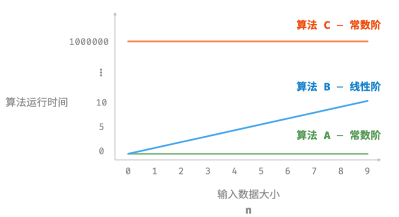
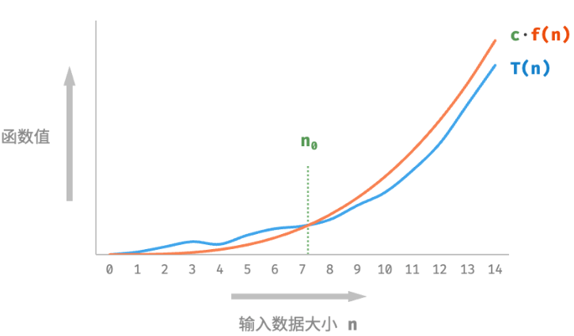
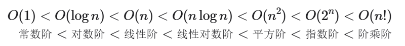
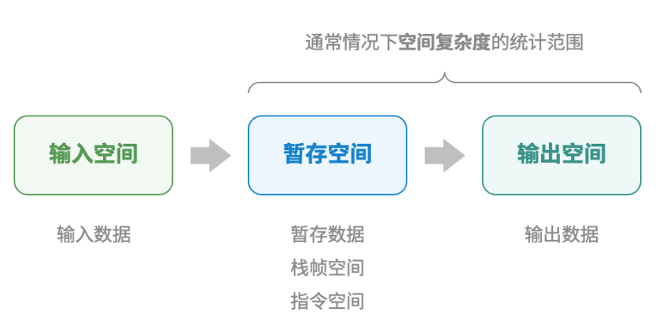
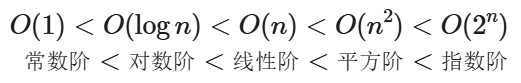

# 算法效率评估
衡量算法优劣的主要评价指标
+ 时间效率：算法运行时间的长短。
+ 空间效率：算法占用内存空间的大小。

效率评估方法主要分为两种
+ 实际测试
  + 有较大的局限性
+ 理论估算
  + 也叫做渐近复杂度分析（asymptotic complexity analysis），简称复杂度分析
  + 它描述了随着输入数据大小的增加，算法执行所需时间和空间的增长趋势
    + 时间和空间资源”分别对应时间复杂度（time complexity）和空间复杂度（space complexity）。
    + “随着输入数据大小的增加”意味着复杂度反映了算法运行效率与输入数据体量之间的关系。
    + “时间和空间的增长趋势”表示复杂度分析关注的不是运行时间或占用空间的具体值，而是时间或空间增长的“快慢”。
  + 好处是：
    + 独立于测试环境，分析结果适用于所有运行平台
    + 可以体现不同数据量下的算法效率，尤其是在大数据量下的算法性能

# 递归与迭代
## 迭代
迭代（iteration）是一种重复执行某个任务的控制结构。在迭代中，程序会在满足一定的条件下重复执行某段代码，直到这个条件不再满足。
+ for循环
+ while循环
+ 嵌套循环
+  ...
## 递归
递归（recursion）是一种算法策略，通过函数调用自身来解决问题。它主要包含两个阶段。
+ 递：程序不断深入地调用自身，通常传入更小或更简化的参数，直到达到“终止条件”。
+ 归：触发“终止条件”后，程序从最深层的递归函数开始逐层返回，汇聚每一层的结果。

而从实现的角度看，递归代码主要包含三个要素。
+ 终止条件：用于决定什么时候由“递”转“归”。
+ 递归调用：对应“递”，函数调用自身，通常输入更小或更简化的参数。
+ 返回结果：对应“归”，将当前递归层级的结果返回至上一层。

递归函数每次调用自身时，系统都会为新开启的函数分配内存，以存储局部变量、调用地址和其他信息等。这将导致两方面的结果。
+ 函数的上下文数据都存储在称为“栈帧空间”的内存区域中，直至函数返回后才会被释放。因此，递归通常比迭代更加耗费内存空间。
+ 递归调用函数会产生额外的开销。因此递归通常比循环的时间效率更低。

如果函数在返回前的最后一步才进行递归调用，则该函数可以被编译器或解释器优化，使其在空间效率上与迭代相当。这种情况被称为尾递归（tail recursion）。
+ 普通递归：当函数返回到上一层级的函数后，需要继续执行代码，因此系统需要保存上一层调用的上下文。
```python
# n+((n-1)+(n-2)+...+2+1)
def recur(n: int) -> int:
    """递归"""
    # 终止条件
    if n == 1:
        return 1
    # 递：递归调用
    res = recur(n - 1)
    # 归：返回结果
    return n + res
# 求和操作是在“归”的过程中执行的，每层返回后都要再执行一次求和操作。
```
+ 尾递归：递归调用是函数返回前的最后一个操作，这意味着函数返回到上一层级后，无须继续执行其他操作，因此系统无须保存上一层函数的上下文。
```python
# 1+2+...+n
def tail_recur(n, res):
    """尾递归"""
    # 终止条件
    if n == 0:
        return res
    # 尾递归调用
    return tail_recur(n - 1, res + n)
# 求和操作是在“递”的过程中执行的，“归”的过程只需层层返回。
```
+ 许多编译器不支持尾递归优化，比如python的

递归树
+ 当处理与“分治”相关的算法问题时，递归往往比迭代的思路更加直观、代码更加易读。
+ 归体现了“将问题分解为更小子问题”的思维范式
+ 观察以上代码（斐波纳契数列），最终将产生一棵层数为n的递归树（recursion tree）
```python
# 0,1,1,2,3,5,8,13...，求该数列的第n个数
def fib(n: int) -> int:
    """斐波那契数列：递归"""
    # 终止条件 f(1) = 0, f(2) = 1
    if n == 1 or n == 2:
        return n - 1
    # 递归调用 f(n) = f(n-1) + f(n-2)
    res = fib(n - 1) + fib(n - 2)
    # 返回结果 f(n)
    return res
```

## 迭代vs递归
+ 迭代：“自下而上”地解决问题。从最基础的步骤开始，然后不断重复或累加这些步骤，直到任务完成。
+ 递归：“自上而下”地解决问题。将原问题分解为更小的子问题，这些子问题和原问题具有相同的形式。接下来将子问题继续分解为更小的子问题，直到基本情况时停止（基本情况的解是已知的）。

例如：f(n)=1+2+...+n
+ 迭代：从1遍历到n并累计求和
+ 递归：f(n)=n+f(n-1)

表格清晰说明：

|      |迭代| 递归                              |
|------|---|---------------------------------|
| 实现方式 |循环结构| 函数调用自身                          |
| 时间效率 |效率通常较高，无函数调用开销| 每次函数调用都会产生开销                    |
| 内存使用 |通常使用固定大小的内存空间| 累积函数调用可能使用大量的栈帧空间               |
|适用问题|适用于简单的循环任务，代码直观，可读性好| 适用于子问题的分解，如树、图、分治、回溯等，代码结构简洁、清晰 |

递归和迭代的内在联系：
+ 递：当函数被调用时，系统会在“调用栈”上为该函数分配新的栈帧，用于存储函数的局部变量、参数、返回地址等数据。
+ 归：当函数完成执行并返回时，对应的栈帧会被从“调用栈”上移除，恢复之前函数的执行环境。

因此，可以使用一个显式的栈来模拟调用栈的行为，从而将递归转化为迭代形式
```python
def for_loop_recur(n: int) -> int:
    """使用迭代模拟递归"""
    # 使用一个显式的栈来模拟系统调用栈
    stack = []
    res = 0
    # 递：递归调用
    for i in range(n, 0, -1):
        # 通过“入栈操作”模拟“递”
        stack.append(i)
    # 归：返回结果
    while stack:
        # 通过“出栈操作”模拟“归”
        res += stack.pop()
    # res = 1+2+3+...+n
    return res
```
观察以上代码，当递归转化为迭代后，代码变得更加复杂了。尽管迭代和递归在很多情况下可以互相转化，但不一定值得这样做，有以下两点原因。
+ 转化后的代码可能更加难以理解，可读性更差。
+ 对于某些复杂问题，模拟系统调用栈的行为可能非常困难。

# 时间复杂度

## 统计时间增长趋势
时间复杂度分析统计的不是算法运行时间，而是 **算法运行时间随着数据量变大时的增长趋势**。
```python
# 算法 A 的时间复杂度：常数阶
def algorithm_A(n: int):
    print(0)
# 算法 B 的时间复杂度：线性阶
def algorithm_B(n: int):
    for _ in range(n):
        print(0)
# 算法 C 的时间复杂度：常数阶
def algorithm_C(n: int):
    for _ in range(1000000):
        print(0)
```


## 函数渐进上界
时间复杂度记为O(n)，这个数学符号称为大O记号,表示函数T(n)的渐近上界（asymptotic upper bound）。

渐进上阶定义：
  - 若存在正实数c和实数n0,使得对于所有的n>n0,均有T(n)≤c·f(n),则可认为f(n)给出了T(n)的一个渐近上
界，记为T(n)=O(f(n))


## 推算方法
两步：
+ 首先统计操作数量。针对代码，逐行从上到下计算即可。
  + 忽略T(n)中的常数项
  + 省略所有系数。5n+1、2n...等都简化记为n次
  + 循环嵌套时使用乘法
+ 然后判断渐近上界。时间复杂度由T(n)中最高阶的项来决定。

## 常见类型


## 最差、最佳、平均时间复杂度
算法的时间效率往往不是固定的，而是与输入数据的分布有关。

长度为n的数组 nums，每个数字只出现一次是返回元素1的索引
+ 当 nums = [?, ?, ..., 1] ，即当末尾元素是1时，需要完整遍历数组，达到最差时间复杂度O(n)
+ 当 nums = [1, ?, ?, ...] ，即当首个元素为1时，无论数组多长都不需要继续遍历，达到最佳时间复杂度Ω(1)

“最差时间复杂度”对应函数渐近上界，使用大O记号表示。相应地，“最佳时间复杂度”对应函数渐近下界，用Ω记号表示。最差时间复杂度更为实用，因为它给出了一个效率安全值

相比之下，平均时间复杂度可以体现算法在随机输入数据下的运行效率，用θ记号来表示。但是平均时间复杂度计算困难。通常采用最坏时间复杂度作为算法效率的评判标准。
 
# 空间复杂度
空间复杂度（space complexity）用于衡量算法占用内存空间随着数据量变大时的增长趋势。

## 算法相关空间
算法在运行过程中使用的内存空间主要包括以下几种:
+ 输入空间：用于存储算法的输入数据。
+ 暂存空间：用于存储算法在运行过程中的变量、对象、函数上下文等数据。
  + 暂存数据：用于保存算法运行过程中的各种常量、变量、对象等。
  + 栈帧空间：用于保存调用函数的上下文数据。系统在每次调用函数时都会在栈顶部创建一个栈帧，函数返回后，栈帧空间会被释放。
  + 指令空间：用于保存编译后的程序指令，在实际统计中通常忽略不计。
+ 输出空间：用于存储算法的输出数据。

在分析一段程序的空间复杂度时，通常统计**暂存数据**、**栈帧空间**和**输出数据**三部分


```python
class Node:
    """类"""
    def __init__(self, x: int):
        self.val: int = x              # 节点值
        self.next: Node | None = None  # 指向下一节点的引用

def function() -> int:
    """函数"""
    # 执行某些操作...
    return 0

def algorithm(n) -> int:  # 输入数据
    A = 0                 # 暂存数据（常量，一般用大写字母表示）
    b = 0                 # 暂存数据（变量）
    node = Node(0)        # 暂存数据（对象）
    c = function()        # 栈帧空间（调用函数）
    return A + b + c      # 输出数据
```
## 推算方法
通常只关注**最差空间复杂度**，“最差”有两层含义：
+ **以最差输入数据为准**：当n<10时，空间复杂度为O(1);但当n>10时，初始化的数组nums占用 O(n)空间，因此最差空间复杂度为O(n)。
+ **以算法运行中的峰值内存为准**：例如，程序在执行最后一行之前，占用O(1)空间；当初始化数组nums时,程序占用O(n)空间，因此最差空间复杂度为O(n)。

在递归函数中，需要注意统计栈帧空间

## 常见类型


常数阶O(1)
+ 常量、变量、对象 ...
+ 在循环中初始化变量或调用函数而占用的内存，在进入下一循环后就会被释放，因此不会累积占用空间，空间复杂度仍为O(1)

对数阶O(log n)
+ 分治 ...

线性阶O(n)
+ 数组、链表、栈、队列 ...

平方阶o(n^2)
+ 矩阵、图 ...

指数阶O(2^n)
+ 二叉树 ...

## 权衡时间和空间
降低时间复杂度通常需要以提升空间复杂度为代价，反之亦然。

在大多数情况下，时间比空间更宝贵，因此“以空间换时间”通常是更常用的策略。

