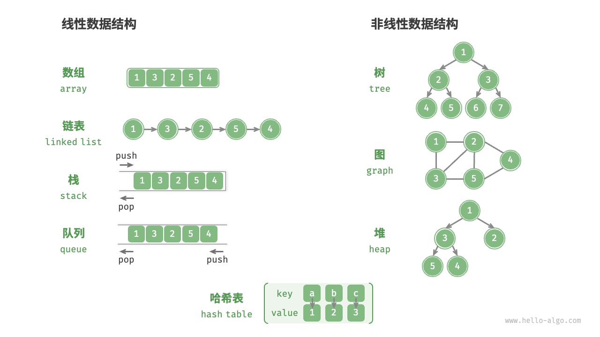
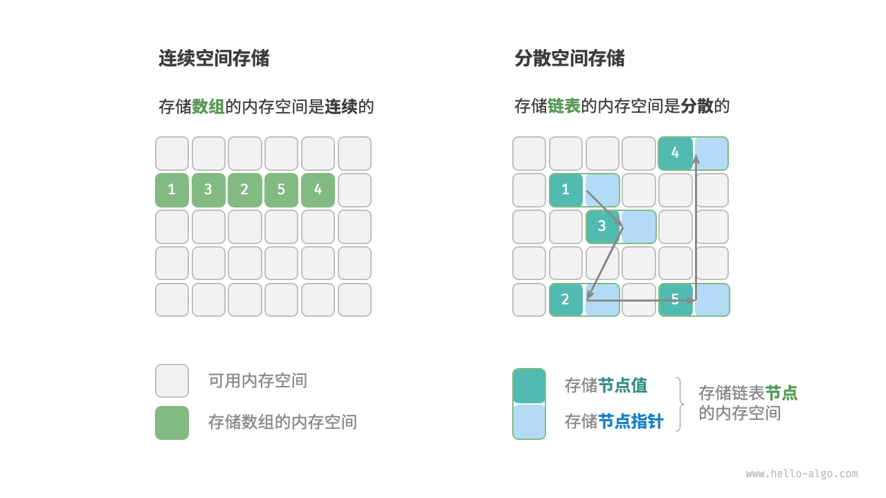

# 数据结构分类
数据结构是在计算机中组织与存储数据的方式

常见的数据结构包括数组、链表、栈、队列、哈希表、树、堆、图，它们可以从“逻辑结构”和“物理结构”两个维度进行分类。

## 逻辑结构：线性、非线性
逻辑结构揭示了数据元素之间的逻辑关系
+ 线性数据结构：数组、链表、栈、队列、哈希表，元素之间是一对一的顺序关系。
+ 非线性数据结构：树、堆、图、哈希表。
  + 树形结构：树、堆、哈希表，元素之间是一对多的关系。 
  + 网状结构：图，元素之间是多对多的关系。

## 物理结构：连续、分散

**所有数据结构都是基于数组、链表或二者的组合实现的**
+ 基于数组可实现：栈、队列、哈希表、树、堆、图、矩阵、张量（维度>=3的数组）等。 
+ 基于链表可实现：栈、队列、哈希表、树、堆、图等。

链表在初始化后，仍可以在程序运行过程中对其长度进行调整，因此也称“动态数据结构”。数组在初始化后长度不可变，因此也称“静态数据结构”。值得注意的是，数组可通过重新分配内存实现长度变化，从而具备一定的“动态性”。

# 基本数据类型
计算机中的数据有文本、图片、视频、语音、3D 模型等各种形式。尽管这些数据的组织形式各异，但它们都由各种基本数据类型构成。

**基本数据类型是 CPU 可以直接进行运算的类型**

主要分为：
+ 整数类型 byte、short、int、long 。
+ 浮点数类型 float、double ，用于表示小数。
+ 字符类型 char ，用于表示各种语言的字母、标点符号甚至表情符号等。
+ 布尔类型 bool ，用于表示“是”与“否”判断。

基本数据类型以二进制的形式存储在计算机中

**基本数据类型提供了数据的“内容类型”，而数据结构提供了数据的“组织方式”**

# 数字编码

# 字符编码

